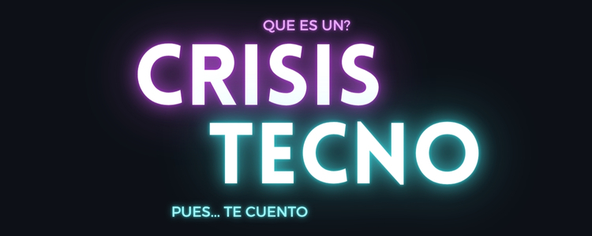
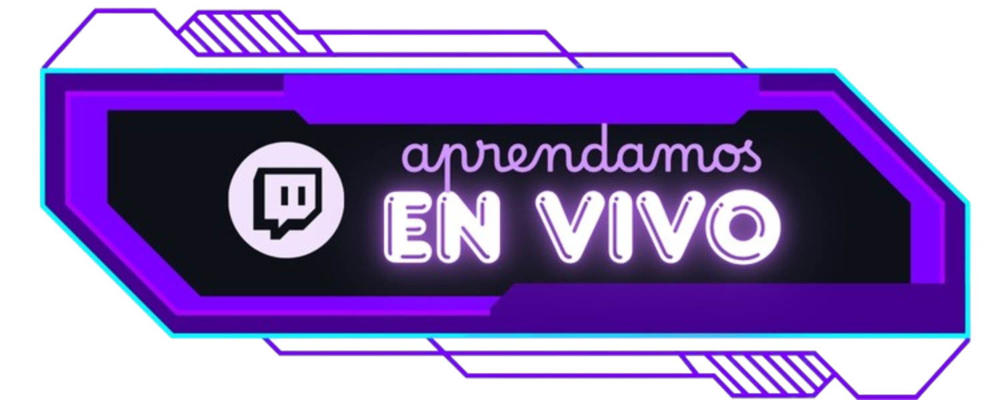

  

<h1 align="center"><b>BIENVENIDO TECNONAUTA, LIST@ PARA ABRAZAR EL FUTURO? 🚀</b></h1>
<h1 align="center"><b>AQUI CRISISTECNO</b></h1>
<h1 align="center">
  
</h1>

<!-- Avatar centrado con decoraciones laterales -->
<table align="center">
  <tr>
    <td align="center" valign="middle">
      
    </td>
    <td align="center" valign="middle">
      
    </td>
    <td align="center" valign="middle">
      
    </td>
  </tr>
</table>

<h2 align="center">RESUMEN PROFESIONAL</h2>

  Desarrollador <strong>Front‑End Full‑Stack</strong>, entusiasta de la <strong>tecnología</strong> y las <strong>soluciones</strong>.
  Apasionado por crear productos digitales que <strong>simplifiquen</strong> la vida de las personas (usuarios) y
  <strong>optimicen</strong> procesos empresariales.

<!-- Sobre mí -->
<h2 align="center">ACERCA DE MI</h2>

  <em>
    Soy <strong>autodidacta certificado</strong>. Mi ruta de aprendizaje independiente me ha llevado a comprender cómo funcionan las
    <strong>aplicaciones web</strong> y <strong>móviles</strong> de extremo a extremo: desde la interfaz hasta su comunicación con
    <strong>servidores</strong> y <strong>bases de datos</strong>. En mi experiencia laboral me he destacado por buscar siempre
    <strong>la mejor solución</strong>, con foco en el <strong>usuario final</strong> buscando siempre ofrecer resultados de calidad con suma atención a los <strong>detalles</strong> que marcan la diferencia ✨.
  </em>

<!--stack-->
<h2 align="center">MI STACK</h2>

<em>
  Fundamentos → Front‑End → Back‑End → Datos → Despliegue/DevOps → Móvil
</em>

<h3 align="center"><em>Fundamentos 🌱</em></h3>

  

<h3 align="center"><em>Front‑End ⚛️</em></h3>

  

<h3 align="center"><em>Back‑End 🛠️</em></h3>

  

<h3 align="center"><em>Datos 🗄️</em></h3>

  

<h3 align="center"><em>Despliegue / DevOps ☁️</em></h3>

  

<h3 align="center"><em>Móvil 📱</em></h3>

  

  

<!-- Aportes y propósito -->

  <em>
    <strong>CrisisTecno</strong> es mi orgullo personal: un espacio donde comparto conocimientos y experiencias en
    <strong>Front‑End</strong> y <strong>Full‑Stack</strong>. A través de contenido educativo, tutoriales y proyectos prácticos,
    busco inspirar y ayudar a otros a crecer en sus habilidades tecnológicas.
  </em>

  <strong>¡Sígueme para seguir creando contenido! 👊</strong>

<!-- Botones de redes -->

  
  &nbsp;&nbsp;&nbsp;
  

  <em>
    Gran parte de lo que he aprendido proviene de recursos gratuitos, que me abrieron puertas y oportunidades.
    Mi objetivo con <strong>CrisisTecno</strong> es <strong>devolver a la comunidad</strong>, creando contenido de calidad que facilite el
    aprendizaje y el desarrollo profesional de otros entusiastas. <strong>Siempre mostrando lo alucinante y divertido de este mundo,
    invitándote a abrazar el futuro</strong> 🌟.
  </em>

  <em><strong>Mi misión:</strong> mostrar el futuro, hoy.</em>

 

